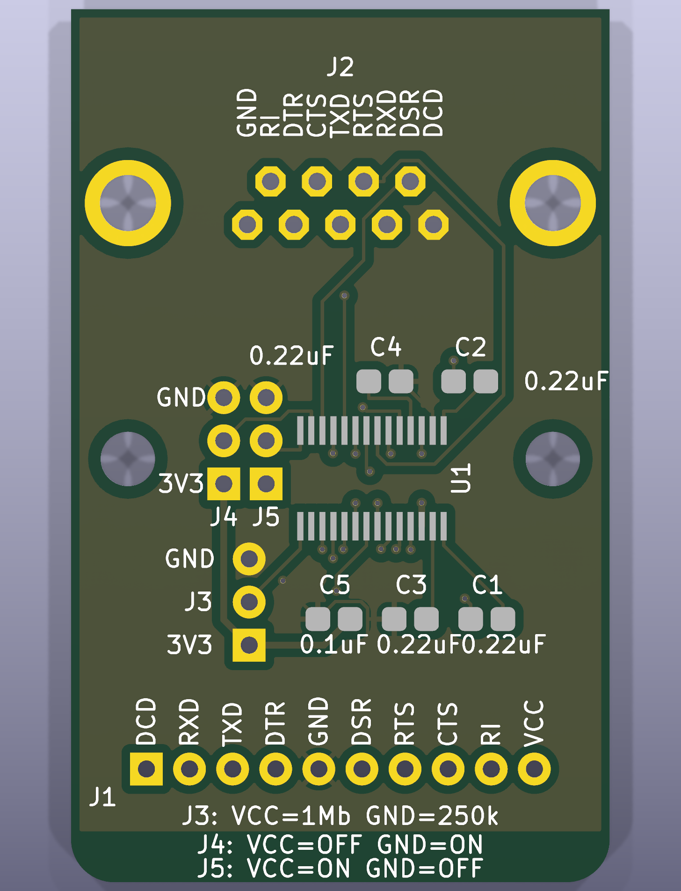
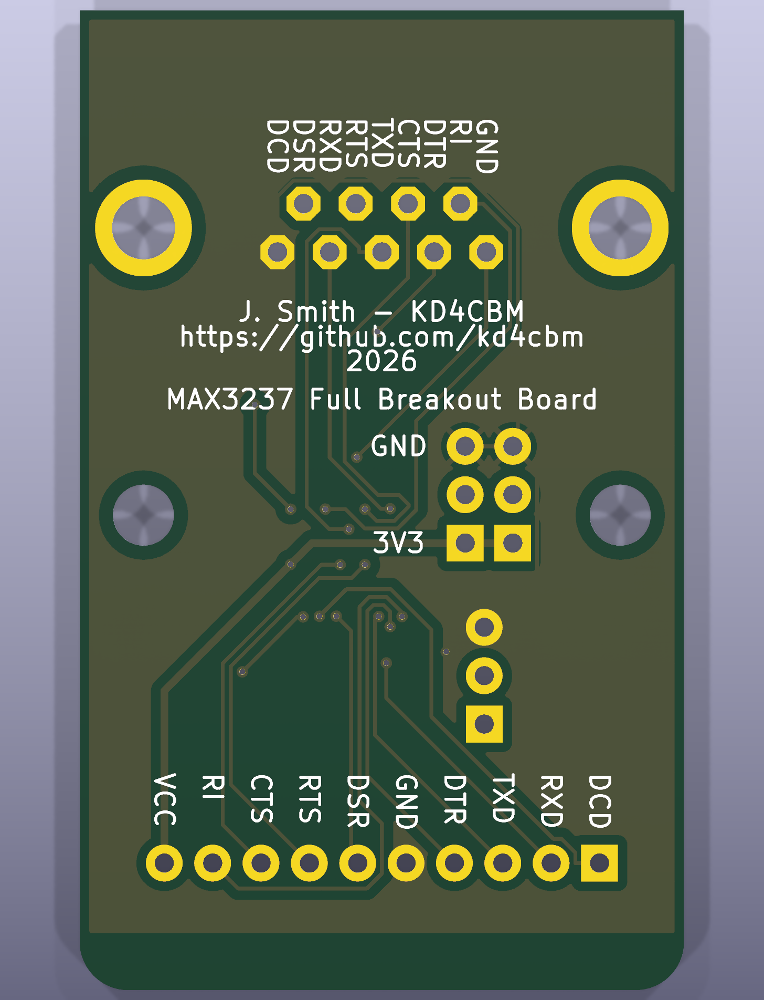

# MAX3237 Full Breakout Board (DCE)

A 2-layer breakout board that converts a 3.3V TTL UART into true RS-232 levels
using the [Maxim/TI MAX3237](https://www.analog.com/media/en/technical-documentation/data-sheets/max3222-max3241.pdf),
wired as **DCE** (modem-side) so it plugs directly into a DTE (terminal/PC)
with a standard straight-through DE-9 cable. Built as the RS-232 front end
for the [RetroWiFiModem](https://github.com/kd4cbm/Zimodem-VFD) project's
ESP32-S3 port, but usable standalone anywhere a 3.3V-logic device needs a
real RS-232 port.

## ⚠ Known issue in previously-manufactured boards: J2 footprint was rotated 180°

Boards ordered from `main` **before this fix** have the J2 DE-9 footprint
rotated 180° from correct relative to the schematic - both left-right *and*
which physical row (the 5-pin row vs. the 4-pin row) sits nearer the board
edge are affected. The pads and copper are internally consistent with each
other and with the net names below, but the physical pin layout does not
match the standard DE-9 pinout - if you plug a straight-through cable into
an affected board, you will connect to the wrong signal on every pin except
5 (GND, which sits on the connector's center axis).

This shipped in two stages. An initial fix (commit `0a0792f`) corrected the
left-right pin order, verified at the time against KiCad's own standard
`Connector_Dsub` library footprint - but that check only compared left-right
order and missed that the two pin rows were *also* swapped front-to-back, so
boards built from that revision alone still had the 5-pin row nearer the
board edge instead of the 4-pin row. That was caught on a second, closer
comparison against the same trusted footprint (this time checking full 2-D
pad geometry, not just left-right rank) and against the actual net-name
silkscreen labels, and is corrected as of commit `1042daa` - J2 rotated the
remaining 180°, all copper ripped and rerouted again.

**If you already have a board built from `main` before this revision** -
whether it predates the first fix or only the second - do not assume the J2
pins match the table below. Either replace the board with one built from
this revision, or trace out each pin with a meter against the
schematic/netlist and build a corrected cable or adapter for that specific
board before relying on it.

## Connectors

**J1 - TTL header** (10-pin, 2.54mm, 3.3V logic side)

| Pin | 1 | 2 | 3 | 4 | 5 | 6 | 7 | 8 | 9 | 10 |
|---|---|---|---|---|---|---|---|---|---|---|
| Signal | DCD | RXD | TXD | DTR | GND | DSR | RTS | CTS | RI | VCC |

**J2 - DE-9 female** (RS-232 side, DCE pinout - wire straight through to a DTE)

Standard DE-9 DCE pinout: DCD(1), RXD(2), TXD(3), DTR(4), GND(5), DSR(6),
RTS(7), CTS(8), RI(9).

## Function jumpers

Each jumper is a 3-pin header: pin 1 (square pad) = +3.3V, pin 3 (round pad)
= GND, pin 2/center = the signal. Bridge pins 1-2 or 2-3 with a shunt to pick
a state.

| Jumper | Function | VCC position | GND position |
|---|---|---|---|
| J3 | MBAUD (data rate select) | MegaBaud mode, up to 1Mbps | Normal mode, up to 250kbps |
| J4 | EN&#772; (receiver enable, active-low) | Receivers disabled (high-Z) | Receivers enabled (normal) |
| J5 | SHDN&#772; (shutdown, active-low) | Normal operation | Shutdown, <1uA supply current |

## Capacitors

Per the MAX3237 datasheet's Table 2, worst-case row (VCC = 3.3V &plusmn;10%):

- **C1, C2, C3, C4** - 0.22uF, charge-pump/reservoir caps
- **C5** - 0.1uF, VCC bypass (the standard smaller bypass value, independent
  of the charge-pump table)

All five are 0805 ceramic MLCC. See [Assembly](#assembly-jlcpcb-pcba) for
sourcing notes.

## Board

- 2-layer, 31.75 x 41.93mm, JLCPCB-manufacturable (checked against their
  published capabilities: trace/clearance, via annular ring &ge;0.18mm,
  silkscreen &ge;1.0mm/0.15mm, hole-to-hole spacing, copper-to-edge)
- GND poured on both copper layers
- Two M3 mounting holes, X-aligned with the DE-9 connector's own built-in
  mounting/jackscrew posts so both hole pairs share one centerline
- Keepout zones around all four plated mounting holes (the 2 board holes +
  the DE-9's own 2 hardware holes) so a copper pour can't bridge to a
  grounded chassis screw
- Routed with [Freerouting](https://github.com/freerouting/freerouting) 2.3.0

## Assembly (JLCPCB PCBA)

This board is set up for **SMD-only PCBA**: JLCPCB places U1 and C1-C5 (all
SMD); the DE-9 socket, TTL header, and 3 jumpers are through-hole and ship
loose for hand-soldering afterward - they're simple, forgiving parts to
solder by hand, and this keeps assembly cost and lead time down versus
sourcing THT parts for machine placement.

Files in [`hardware/`](hardware/):

- `kicad/` - full KiCad 10 project (schematic + PCB)
- `gerbers/Gerbers_*.zip` - Gerber + Excellon drill files, ready to upload
- `CPL_SMD.csv` - placement/position file (SMD parts only)
- `BOM_PCBA_JLCPCB.csv` - PCBA bill of materials (SMD parts only). U1's LCSC
  part number (`C2671155`, MAX3237EIPWR) is verified against LCSC's own
  listing. The capacitor rows intentionally list full specs (0805, X7R,
  value, &ge;16V) with **no** LCSC number - JLCPCB's basic-parts catalog is a
  live, dynamic search that isn't reliably scriptable, and these are common
  enough values that matching one at checkout takes seconds. Verify current
  stock/pricing before ordering rather than trusting a number pinned months
  earlier.
- `BOM_full.csv` - every part on the board, including the through-hole
  connectors, for your own reference/hand-assembly shopping list

**Before ordering, check U1's orientation in JLCPCB's assembly preview.**
`CPL_SMD.csv` currently has U1 at rotation 180, verified against JLCPCB's
own preview tool - but this value depends on which specific LCSC library
part they match to the MAX3237EIPWR footprint (`C2671155`), and that
match/library entry can change over time. If U1 looks rotated in their
preview, JLCPCB's placement review UI lets you rotate a part directly and
save the correction - no need to regenerate any files for a one-off order.
A quick way to confirm correct placement without knowing the datasheet by
heart: pin 1 is on the net `/MAX-C2+`, i.e. it should land right next to
**C2**'s own pad (not C4, and not on the opposite pin row).

## Revision history

| Rev | Notes |
|---|---|
| 0 | Original layout, master reference |
| 1 | Pre-routing checkpoint (placement + keepouts finalized) |
| 2 | Post-routing checkpoint (Freerouting output, traces only) |
| 3 | Added GND pour, widened VCC traces |
| 4 | JLCPCB via/silkscreen compliance fixes, RXD/TXD silkscreen wording |
| 5 | Partial fix for mirrored J2 (DE-9) footprint - corrected left-right pin order only; row-to-edge assignment was still wrong (see rev 6) |
| 6 | Completed the J2 (DE-9) footprint fix: rotated the remaining 180° so the 4-pin row is nearer the board edge; full copper rip/reroute/repour; see [Known issue](#-known-issue-in-previously-manufactured-boards-j2-footprint-was-rotated-180) above |
| 7 | Cleared two starved-thermal DRC warnings (J2/J3 GND pads set to solid zone connection); no pad or copper changes |
| 8 | **Current** - Full copper rip/reroute/repour (no pad changes) to clean up scattered clearance-void shapes left by earlier auto-routes; added a dedicated `Power` net class so `+3.3V` routes at 0.4mm instead of the 0.2mm signal-trace default |

## License

Hardware design files (schematic, PCB, Gerbers) are released under
[CERN-OHL-W v2](https://cern-ohl.web.cern.ch/) - a weakly-reciprocal open
hardware license: you're free to use, modify, and manufacture this design,
including commercially; modifications to these design files themselves stay
open, but boards built from them (or your own separate designs that merely
use this one) don't inherit that obligation. See [LICENSE](LICENSE).
